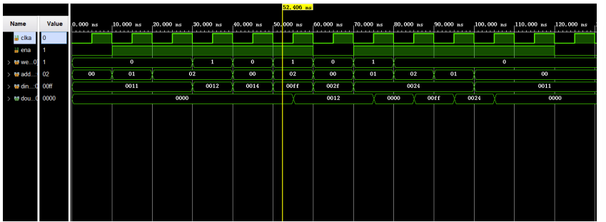

# 寄存器堆与存储器及其应用

> 计算机组成原理实验 二
>
> PB20020480

## 一、实验目的

- 掌握寄存器堆(Register File)和存储器的功能 、时序及其应⽤
- 掌握寄存器堆(Register File)和存储器的功能 、时序及其应⽤

## 二、实验环境

- Windows11
- Vivado2019
- NEXYS 4 DDR

## 三、寄存器堆

### 1.实验内容

三端口的$2^m\times n$位寄存器堆

•ra0, rd0：异步读端口0

•ra1, rd1：异步读端口1

•wa, wd, we：同步写端口

•clk：时钟


−寄存器堆的0号寄存器内容恒定为零

−寄存器堆的写操作优先于读操作

### 2.核心代码

```verilog
module  register_file  #(
    parameter AW = 5,		//地址宽度
    parameter DW = 32		//数据宽度
)(
    input  clk,			//时钟
    input [AW-1:0]  ra0, ra1,	//读地址
    output wire[DW-1:0]  rd0, rd1,	//读数据
    input [AW-1:0]  wa,		//写地址
    input [DW-1:0]  wd,		//写数据
    input we			//写使能
);
reg [DW-1:0]  rf [0: 31]; 	//寄存器堆
reg [AW-1:0] ad0,ad1;
reg [DW-1:0] d0,d1;

    assign rd0 = (ra0==5'b0)? (32'b0):d0;	//0号寄存器为0
assign rd1 = (ra1==5'b0)? (32'b0):d1;	//读操作

always  @(posedge  clk)
    if (we)begin
       if(wa!=5'b0)begin
            d0<= ((ra0==wa)? wd:rf[ra0]);
            d1<= ((ra1==wa)? wd:rf[ra1]);   
            rf[wa]  <=  wd;		//写操作
        end else begin
            d0<=rf[ra0];
            d1<=rf[ra1];
        end
    end else begin
        d0<=rf[ra0];
        d1<=rf[ra1];
    end
    

endmodule
```


### 3.仿真


## 四、IP 例化分布式和块式 16 x 8 位单端口RAM

### 1、逻辑设计

利⽤ IP 核中的 Block Memory Generator 以及 Distributed Memory Generator，⽣成 256×16 位分布式存储器和 256×16 位块式存储器

### 2、例化端口

#### 分布式

```verilog
dist_mem_gen_0 dram_256_16 (
  .a(a),      // input wire [7 : 0] a
  .d(d),      // input wire [15 : 0] d
  .clk(clk),  // input wire clk
  .we(we),    // input wire we
  .spo(spo)  // output wire [15 : 0] spo
);
```

#### 块式

```verilog
blk_mem_gen_0 your_instance_name (
  .clka(clka),    // input wire clka
  .ena(ena),      // input wire ena
  .wea(wea),      // input wire [0 : 0] wea
  .addra(addra),  // input wire [7 : 0] addra
  .dina(dina),    // input wire [15 : 0] dina
  .douta(douta)  // output wire [15 : 0] douta
);
```

### 3、仿真与对比

分布式与块式对比可以看到，主要区别在于读口，当分布式使能改变，读口的值立马随之改变，而块式会有时延。

块式的写优先时，读口的值会随之在下个时钟周期改变；而读优先时，只会在“使能”变为0（读）后的下个上升沿改变。

##### 分布式仿真


##### 块式


##### 块式 写优先


##### 块式 读优先



## 五、数据输入输出与排序

### 1、实验内容

- **数据输入/输出**

–采用分布式双端口存储器保存数据，例化时可以初始化数据

–利用chk查看数据，数码管显示存储器的地址和数据

–利用x、del、addr、data设置地址和修改数据

- **数据排序**

-run启动排序, 同时启动时钟计数cnt，busy置1

-排序时不能人工查看和修改数据

-排序结束后停止计数，busy清零


- **开关数字输入与按键输入**

假定任何时刻只改变16个开关x(sw15-0)中一个开关状态

每次向上或向下拨动一次开关，生成位十六进制数h，即4位二进制数，同时产生持续1个时钟周期的脉冲p


每次长按功能按钮1s后，使其产生脉冲


- **数据通路及其操作**

–rstn：a = 0, d = 0, s = 0

–chk_p：a = a + 1, s = 0

–p：d = {d[11:0], h}, s = 1

–del_p：d = d[15:4], s = 1

–data_p：M[a] = d, d = 0, a = a + 1, s = 0

–addr_p：a = d[7:0], d = 0, s = 0


### 2.功能仿真

#### 排序前


##### 排序后


### 3.状态机


### 4.核心代码

#### DP:负责对按键操作去抖，产生脉冲

```verilog
`timescale 10ns / 1ns


module DP(
    input clk,
    
    input chk,
    input del,
    input data,
    input addr,
    input run,
   
    output chk_p,
    output del_p,
    output data_p,
    output addr_p,
    output run_p
    );
    
    reg[31:0] count=32'b0;
    wire[4:0] flag;
    reg p[0:4];
    initial begin
    p[0]=0;
    p[1]=0;
    p[2]=0;
    p[3]=0;
    p[4]=0;
    end
    assign chk_p=p[0];
    assign del_p=p[1];
    assign data_p=p[2];
    assign addr_p=p[3];
    assign run_p=p[4];
    assign flag[0] = (chk==1)? 1'b1 : 1'b0;
    assign flag[1] = (del==1)? 1'b1 : 1'b0;
    assign flag[2] = (data==1)? 1'b1 : 1'b0;
    assign flag[3] = (addr==1)? 1'b1 : 1'b0;
    assign flag[4] = (run==1) ? 1'b1 : 1'b0;
    always@(posedge clk)begin
        case(flag)
            5'b00001:
            begin
                count <= count + 1'b1;                
                if(count=='d5000000)begin
                    p[0]<=1'b1;
                end else p[0]<=1'b0;
            end
            5'b00010:
            begin
                  count<=count+1'b1;  
                 if(count=='d5000000)
                    begin
                         p[1]<=1'b1;
                    end else p[1]<=1'b0;
            end
            5'b00100:
            begin
                  count<=count+1'b1;  
                  if(count=='d5000000)
                    begin
                         p[2]<=1'b1;
                    end else p[2]<=1'b0;
            end
            5'b01000:
            begin
                  count<=count+1'b1;  
                  if(count=='d5000000)
                    begin
                         p[3]<=1'b1;
                    end else p[3]<=1'b0;
            end
            5'b10000:
            begin
                    count<=count+1'b1;  
                  if(count=='d5000000)
                    begin
                         p[4]<=1'b1;
                    end else p[4]<=1'b0;
            end
            default:
            begin
                  count<=32'b0;
                  p[0]<=0;p[1]<=0;p[2]<=0;p[3]<=0;
            end
        endcase
    end
endmodule

```

#### DEP:负责对switch按键消抖，并产生16进制数与脉冲

```verilog
`timescale 1ns / 1ps


module DEP
    (
    input clk,
    input [15:0] x,

    output [3:0] h,
    output  p
    );
    reg[15:0] temp_h=16'b0;
    reg[15:0] curx=16'b0;
    reg[3:0] curh=4'b0;

    reg[31:0] count=32'b0;
    wire flag;
    reg real_flag=0,temp=0;
    assign h=curh,p=temp;
    assign flag = (curx!=x)? 1'b1 : 1'b0;
    always@(posedge clk )begin
        if(flag==1)begin
            count <= count + 1'b1;
        end else begin
            count <= 32'b0;
            temp <= 0;
            curh<=curh;
        end
        if(count=='d10000000)begin
            real_flag <= 1'b1;
            temp_h <= (curx ^ x);
            curx <= x;
        end
        if(real_flag==1)begin
           case(temp_h)
                16'b0000_0000_0000_0001:curh<=4'h0;
                16'b0000_0000_0000_0010:curh<=4'h1;
                16'b0000_0000_0000_0100:curh<=4'h2;
                16'b0000_0000_0000_1000:curh<=4'h3;
                16'b0000_0000_0001_0000:curh<=4'h4;
                16'b0000_0000_0010_0000:curh<=4'h5;
                16'b0000_0000_0100_0000:curh<=4'h6;
                16'b0000_0000_1000_0000:curh<=4'h7;
                16'b0000_0001_0000_0000:curh<=4'h8;
                16'b0000_0010_0000_0000:curh<=4'h9;
                16'b0000_0100_0000_0000:curh<=4'ha;
                16'b0000_1000_0000_0000:curh<=4'hb;
                16'b0001_0000_0000_0000:curh<=4'hc;
                16'b0010_0000_0000_0000:curh<=4'hd;
                16'b0100_0000_0000_0000:curh<=4'he;
                16'b1000_0000_0000_0000:curh<=4'hf;
           endcase
           real_flag<=0;
           temp<=1;
        end
    end
    
    
endmodule

```

#### segment_trans :对输入的数字，在数码管上显示

```verilog
module segment_trans(
    input       clock,
    input       reset,
    input [3:0] counter0,
    input [3:0] counter1,
    input [3:0] counter2,
    input [3:0] counter3,
    input [3:0] counter4,
    input [3:0] counter5,
    input [3:0] counter6,
    input [3:0] counter7,
    output reg [7:0] an,
    output reg [6:0] segment_out
);

parameter
            Hexx = 7'b1111111,
            Hex0 = 7'b0000001, //共阳极数码管
            Hex1 = 7'b1001111,
            Hex2 = 7'b0010010,
            Hex3 = 7'b0000110,
            Hex4 = 7'b1001100,
            Hex5 = 7'b0100100,
            Hex6 = 7'b0100000,
            Hex7 = 7'b0001111,
            Hex8 = 7'b0000000,
            Hex9 = 7'b0000100,
            Hexa = 7'b0001000,
            Hexb = 7'b1100000,
            Hexc = 7'b0110001,    
            Hexd = 7'b1000010,
            Hexe = 7'b0110000,
            Hexf = 7'b0111000;

// Looping digit
localparam N = 19;
reg [N-1:0] regN;
reg[3:0] hex_in;
always@(posedge clock, posedge reset)begin
	if(!reset)
			regN <= 0;
		else
			regN <= regN + 1;
end
always@ *
	begin
		case(regN[N-1:N-3])
		3'b000:begin
			an = 8'b1111_1110; //选中第1个数码管
			hex_in = counter0; //数码管显示的数字由hex_in控制，显示hex0输入的数字；
		end
		3'b001:begin
			an = 8'b1111_1101; //选中第二个数码管
			hex_in = counter1;
		end
		3'b010:begin
			an = 8'b1111_1011; //选中第3个数码管
			hex_in = counter2;
		end
		3'b011:begin
			an = 8'b1111_0111; //选中第4个数码管
			hex_in = counter3;
		end
		3'b100:begin
			an = 8'b1110_1111; 
			hex_in = counter4;
		end
		3'b101:begin
			an = 8'b1101_1111; 
			hex_in = counter5;
		end
		3'b110:begin
			an = 8'b1011_1111; 
			hex_in = counter6;
		end
		3'b111:begin
			an = 8'b0111_1111; 
			hex_in = counter7;
		end
		endcase
	
	end

// Showing digits
always@ *
	begin
        case(hex_in)
        4'h0: begin segment_out = Hex0; end
        4'h1: begin segment_out = Hex1; end
        4'h2: begin segment_out = Hex2; end
        4'h3: begin segment_out = Hex3; end
        4'h4: begin segment_out = Hex4; end
        4'h5: begin segment_out = Hex5; end
        4'h6: begin segment_out = Hex6; end
        4'h7: begin segment_out = Hex7; end
        4'h8: begin segment_out = Hex8; end
        4'h9: begin segment_out = Hex9; end
        4'ha: begin segment_out = Hexa; end
        4'hb: begin segment_out = Hexb; end
        4'hc: begin segment_out = Hexc; end
        4'hd: begin segment_out = Hexd; end
        4'he: begin segment_out = Hexe; end
        4'hf: begin segment_out = Hexf; end
        default: begin segment_out = Hexx; end
        endcase
    end 
endmodule

```

#### data_sort

分为三段，第一段是模块的输入与输出，第二段包含addr,data,del,check,switch输入的等操作具体过程，第三段主要是对run操作中排序算法的描述

##### 模块输入与输出

```verilog
module data_sort(
  input  clk, 
  input  rstn,

  input [15:0]  x,	//输入1位十六进制数字
  input del,		//删除1位十六进制数字
  input addr,		//设置地址
  input data,		//修改数据
  input chk,		//查看下一项
  input run,		//启动排序

  output [7:0]  an,		//数码管显示位置
  output [6:0]  seg,    //数码管显示存储器地址和数据
  output busy,	//1-正在排序，0-排序结束
  output [15:0]  cnt//排序耗费时钟周期数
    );
    segment_trans ST(
  .clock(clk),
  .reset(rstn),
  .counter7(a[7:4]),
  .counter6(a[3:0]),
  .counter5(4'b0),
  .counter4(4'b0),
  .counter3(d[15:12]),
  .counter2(d[11:8]),
  .counter1(d[7:4]),
  .counter0(d[3:0]),
  .an(an),
  .segment_out(seg)
  ); 
  DP dp(clk,chk,del,data,addr,run,chk_p,del_p,data_p,addr_p,run_p);
  
  DEP dep(clk,x,h,p);
  
  dist_mem_gen_1 dmem256_16 (
  .a(Ain),        // input wire [7 : 0] a
  .d(Din),        // input wire [15 : 0] d
  .dpra(dpra),  // input wire [7 : 0] dpra
  .clk(clk),    // input wire clk
  .we(we),      // input wire we
   .spo(spo),  
  .dpo(dpo)    // output wire [15 : 0] dpo
);
```

##### addr,data,del,check,switch输入操作

```verilog
parameter InitState=3'b000,
            InState=3'b001,
            DelState=3'b010,
            DataState=3'b011,
            AddrState=3'b100,
            ChkState=3'b101, 
            RunState=3'b110;
always@(*)begin 
        if(!rstn) begin //当rst=0时，重置。
            s=0;
            nextState = InitState;
            nexta=8'b0;
       end else  begin
            if(busy2==0) begin
            case(state)
                InitState:begin
                        nextd=d;
                        nexta=a;
                        if(p==1)
                            nextState=InState;
                        else if(chk_p==1)begin
                            nextState=ChkState;
                        end else if(del_p==1)begin
                            nextState=DelState;
                        end else if(data_p==1)begin
                            nextState=DataState;
                        end else if(addr_p==1)begin
                            nextState=AddrState;
                        end else if(run_p==1)begin
                            nextState=RunState;
                        end
                        else   nextState=InitState;  
                    end
                InState:begin
                        nextd={d[11:0],h};
                        nexta=a;
                        s=1;
                        nextState=InitState;
                    end
                ChkState:begin
                        tem_dpra=a+1'b1;
                        nexta=a+1'b1;
                        s=0;
                        nextState=InitState;
                    end
                DelState:begin
                        tem_dpra=a;
                        nexta=a;
                        nextd={4'b0000,d[15:4]};
                        s=1;
                        nextState=InitState;
                    end
                DataState:begin
                        tem_dpra=a+1'b1;
                        nexta=a+1'b1;
                        s=0;
                        nextState=InitState;
                    end
                 AddrState:begin
                         nexta=d[7:0];
                         tem_dpra=d[7:0];
                        s=0;
                        nextState=InitState;
                    end
                  RunState:begin
                            s=1;
                            nexta=8'b0;    
                            nextState=InitState;
                    end
             endcase
             end//else -->sort
       end
    
     always@(posedge clk )begin
        if(!rstn)begin
            busy2<=0;
            state<=InitState;
        end
       if(busy==0)begin
            if(s==0)begin
                d<=dpo;
            end else begin
                d<=nextd;
            end
            a<=nexta;
            state<=nextState;
            case(state)
                InitState:begin
                     we<=0;   
                end
                InState:begin
                   
                end
                ChkState:begin
                    
                end
                DelState:begin
               
                end
                DataState:begin
                    Ain<=a;
                    Din<=d;
                    we<=1;
                end
                AddrState:begin
                   
                end
                RunState:begin
                     we<=0;
                     
                     Ain<=0;
                     busy2<=1;
                     index <=0;
                     sort_state <= s0;
                     state<=InitState;
                     count<=0;
              end
            endcase         
         end//else -->sort
     end
```

##### 排序操作

```verilog
//接上文 always@(*)begin
//			if(busy==0) begin
//				...
//			end
//reg[15:0] ram[0:256] 
else begin
          case(sort_state)
                   s0: begin
                            tem_dpra= 0;
                            next_state = s1;
                        end
                        
                   s1: begin
                            //ram[tem_te]<=dpo;
                       if(index<8'b1111_1111)
                                next_state = s2;
                            else 
                                next_state = s4;
                        end
                        
                   s2: begin
                            //ram[index]<=spo;
                            //index++
                            next_state = s3;//赋值，递增
                        end
                        
                   s3: begin
                           //Ain<=index;
                            next_state = s1;
                        end
                        
                   s4: begin
                           // i<=0;
                            //j<=0;
                           //  Ain<=0;
                            next_state = s5;
                        end
                        
                   s5: begin
                       if(i < 'd256)
                                next_state = s6;
                            else
                                next_state = s13;
                        end
                        
                   s6: begin
                             //min_index <= i;
                             // j <= i + 1;
                            next_state = s7;
                    end
                    
                    s7: begin
                        if(j <'d256)
                            next_state = s8;
                        else
                            next_state = s11;
                    end
                    
                    s8: begin
                        if(ram[j] < ram[min_index])
                            next_state = s9;
                        else
                            next_state = s10;
                    end
                    
                    s9: begin
                      //  min_index <= j;
                        next_state = s10;
                    end
                    
                    s10: begin
                   //  j <= j + 1;
                        next_state = s7;
                    end
                    
                    s11: begin
                           // ram[min_index] <= ram[i];
                          //  ram[i] <= ram[min_index];
                         //   sort_state<=next_state;
                          next_state = s12;
                    end
                    
                    s12: begin
                       //  i<= i + 1;
                        next_state = s5;
                    end
                    
                    s13: begin	
                      //  we<=1;
                      //  count1<=0;
                        next_state=s14;
                    end
                    s14:begin
                        if(index1<8'b1111_1111)begin
                            next_state=s14;
                         end else
                            next_state=s15;
                    end
                    default: begin

                        next_state = s0;
                    end
                endcase    
             end


//接上文	always@(posedge clk )begin
//				if(busy==0) begin
//				...
//			end
				
else begin
              count<=count+1;
              case(sort_state)
                        s0:begin
                            sort_state <= next_state;
                        end
                        s1:begin
     
                            sort_state<=next_state;
                        end
                        s2:begin
                           
                           ram[index]<=spo;
                           index<=index+1'b1;
                           sort_state<=next_state;
                        end
                        s3:begin
                            Ain<=index;
                            sort_state<=next_state;
                        end
                        s4:begin
                            i<=0;
                            j<=0;
                            Ain<=0;
                            sort_state<=next_state;
                        end
                        s5:begin  
                            sort_state<=next_state;
                        end
                        s6:begin
                            min_index <= i;
                            j <= i + 1;
                            sort_state<=next_state;
                        end
                        s7:begin  
                            sort_state<=next_state;
                        end
                        s8:begin  
                            sort_state<=next_state;
                        end
                        s9:begin
                             min_index <= j;
                             sort_state<=next_state;
                        end
                        s10:begin
                            j <= j + 1;
                            sort_state<=next_state;
                        end
                        s11:begin
                            
                            ram[min_index] <= ram[i];
                            ram[i] <= ram[min_index];
                            sort_state<=next_state;
                        end
                        s12:begin
                            i<= i + 1;
                            sort_state<=next_state;
                        end
                        s13:begin
                            we<=1;
                            index1<=0;
                            sort_state<=next_state;
                        end
                        s14:begin
                             index1<=index1+1'b1;
                             Ain<=index1;
                             
                             Din<=ram[index1];
                             sort_state<=next_state;
                        end
                        s15:begin
                              Ain<=0;
                              index1<=0;
                              we<=0;
                              busy2<=0;
                              state<=InitState;
                        end
                        default:begin
                            sort_state <= next_state;  
                        end
             endcase
         end
     
```

### 六、结果分析与总结

寄存器堆、IP 核 RAM 的仿真结果和排序的下载结果符合设计⽬标

本次实验学习了 Verilog 的更多知识，并通过寄存器堆、存储器 RAM 及排序，实现了对组合逻辑电 路和时序逻辑电路的巩固，为以后的实验打下基础

## 七、参考文献

https://blog.csdn.net/DayDreamer_FPGA/article/details/104279630

https://cloud.tencent.com/developer/article/1814213

https://blog.csdn.net/DayDreamer_FPGA/article/details/104279630


https://wikichi.icu/wiki/Seven-segment_display

https://blog.51cto.com/u_15338162/3555837

https://blog.csdn.net/qimoDIY/article/details/86747082

https://www.fpga4student.com/2017/09/seven-segment-led-display-controller-basys3-fpga.html?_ga=2.102475208.896102064.1648313699-1280309662.1648313698

https://digilent.com/reference/programmable-logic/nexys-4-ddr/reference-manual


