# 单周期CPU设计

> 计算机组成原理实验 
>
> PB20020480 王润泽

## 实验目的

- 理解CPU的结构和⼯作原理 
- 掌握单周期CPU的设计和调试⽅法 
- 熟练掌握数据通路和控制器的设计和描述⽅法

## 实验环境

OS Windows11

Vivado 2019

FPGA 开发板

## 实验内容

- 设计单周期RISC-V CPU，可执行以下13条指令：

  **add** rd, rs1, rs2

  **sub** rd, rs1, rs2

  **addi** rd, rs1, imm

  **slli** rd, rs1, imm

  **auipc** rd, imm

  **lui** rd, imm

  **lw** rd, offset(rs1)

  **sw** rs2, offset(rs1)

  **beq ** rs1, rs2, offset  

  **blt** rs1, rs2, offset

  **bge** rs1, rs2, offset

  **jal** rd, offset

  **jalr **rd, offset

- 将CPU和PDU整合后下载至FPGA，进行逐条指令功能测试

- 将CPU和PDU整合后下载至FPGA，进行排序程序测试

  

## 实验设计

#### 1.指令集设计

- add rd, rs1, rs2 # x[rd] = x[rs1] + x[rs2]
- sub rd, rs1, rs2

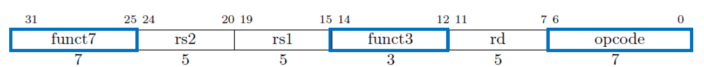

- addi rd, rs1, imm
- slli rd, rs1, imm

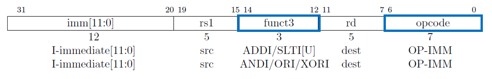

- auipc rd, imm
- lui rd, imm

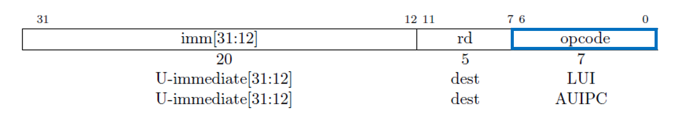

- lw rd, offset(rs1)

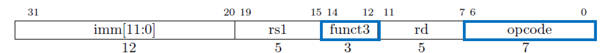

- sw  rs2, offset(rs1)

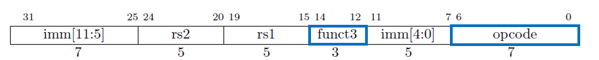

- beq  rs1, rs2, offset 
- blt rs1, rs2, offset
- bge rs1, rs2, offset

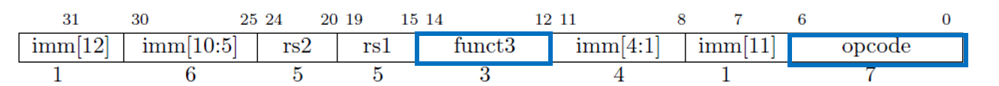

- jal rd, offset

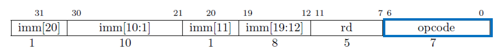

- **jalr **rd, offset

  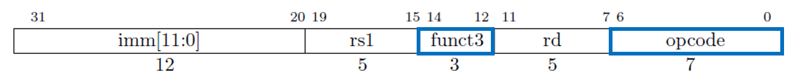

#### 2.单周期CPU与调试接口数据通路

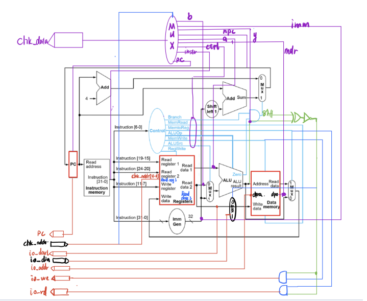


#### 3.PDU设计

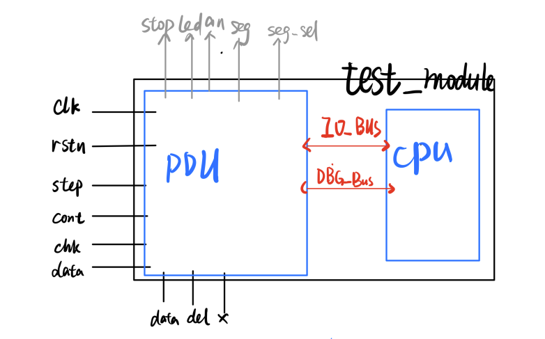

#### 4.模块接口

- **CPU模块接口**

  ```verilog
  module  test_cpu (
    input clk,  //时钟频率不能是100MHZ
    input rstn,
  
    //IO_BUS
    output [7:0]  io_addr,	//外设地址
    output [31:0]  io_dout,	//向外设输出的数据
    output  io_we,		//向外设输出数据时的写使能信号
    output  io_rd,		//从外设输入数据时的读使能信号
    input [31:0]  io_din,	//来自外设输入的数据
  
    //Debug_BUS
    output reg[31:0] pc, 	        //当前执行指令地址
    input [15:0] chk_addr,	    //数据通路状态的编码地址   
    output reg[31:0] chk_data    //数据通路状态的数据
  );
  ```

  

- **PDU模块接口**

```verilog
module  pdu(
        input clk,            //clk100mhz
        input rstn,           //cpu_resetn

        input step,           //btnu
        input cont,           //btnd
        input chk,            //btnr
        input data,           //btnc
        input del,            //btnl
        input [15:0] x,       //sw15-0

        output stop,          //led16r
        output [15:0] led,    //led15-0
        output [7:0] an,      //an7-0
        output [6:0] seg,     //ca-cg
        output [2:0] seg_sel, //led17

        output clk_cpu,       //cpu's clk
        output rst_cpu,       //cpu's rst

        //IO_BUS
        input [7:0] io_addr,
        input [31:0] io_dout,
        input io_we,
        input io_rd,
        output [31:0] io_din,

        //Debug_BUS
        input [31:0] chk_pc,    //连接CPU的npc
        output [15:0] chk_addr,
        input [31:0] chk_data
    );
```


## CPU代码

```verilog
//IO
assign io_we = (alu_out[15:8]==8'hff) & MemWrite;//写使能
assign data_mem_mux = (alu_out[15:8]==8'hff)?io_din:data_mem_out;//当不由内存写入回寄存器时，由外设写入
assign io_rd = (alu_out[15:8]==8'hff) & (MemtoReg==WB_RD);//读使能
assign io_dout = reg_rd2;  //e.g. sw x10 4(0xff00) 计算 外设的地址 并向外设存值
assign io_addr = alu_out[7:0];
/*Debug*/
always@(*)begin
    case(chk_addr[13:12])
      2'b00:begin
        case(chk_addr[3:0])
            4'h0: chk_data = next_pc;
            4'h1: chk_data = pc;
            4'h2: chk_data = instruction;
            4'h3: chk_data = {Branch,MemtoReg,AluOp,MemWrite,AluSrc,RegWrite};    
            4'h4: chk_data = reg_rd1;
            4'h5: chk_data = reg_rd2;
            4'h6: chk_data = extend_imm;
            4'h7: chk_data = alu_out;
            4'h8: chk_data = data_mem_mux;
        endcase
      end
      2'b01:begin
        chk_data = r_data;  
      end
      2'b10:begin
        chk_data = m_data;
      end
    endcase
end


//pc control
assign pc_add=pc+32'd4;
assign pc_sum=extend_imm+pc;
always@(*)begin
    case(Branch)
        B_E:next_pc=(alu_z[0] & (~alu_z[1])) ? pc_sum:pc_add;
        B_L:next_pc=(alu_z==2'b10) ? pc_sum:pc_add;
        B_G:next_pc=(alu_z==2'b10) ? pc_add:pc_sum;
        J_JAL:next_pc = pc_sum;
        I_JALR:next_pc = {alu_out[31:1],1'b0}; 
        B_NULL:next_pc = pc_add;
        default:next_pc=pc_add;
    endcase
end 

always@(posedge clk, posedge rstn)begin
  if (rstn) begin
      pc <= 32'd0;
  end else begin
      pc <= next_pc;
  end
end

//get IC
inst_mem2 inst_mem(pc[9:2], instruction);

assign opcode = instruction[6:0];
assign funct3 = instruction[14:12];
assign funct7 = instruction[31:25];
assign rs1 = instruction[19:15];
assign rs2 = instruction[24:20];
assign rd =  instruction[11:7];
//register

reg_file #(32) Register
                (.clk(clk), 
                .ra0(rs1), 
                .ra1(rs2),
                .ra2(chk_addr[4:0]),
                .rd0(reg_rd1), 
                .rd1(reg_rd2),
                .rd2(r_data),
                .wa(rd), 
                .we(RegWrite), 
                .wd(reg_wd));
                
always @(*) begin //reg write back control
    case (MemtoReg)
        WB_ALU: reg_wd = alu_out;
        WB_RD:  reg_wd = data_mem_mux;
        WB_PC_ADD:reg_wd = pc_add;
        WB_PC_SUM:reg_wd = pc_sum; 
        WB_LUI:reg_wd = extend_imm;
        default: reg_wd = 0;
    endcase
end
    
//CALCULATE ALU
assign alu_a = reg_rd1;
assign alu_b = AluSrc ? extend_imm : reg_rd2;//是写入立即数还是寄存器读口？
alu  ALU(.a(alu_a), .b(alu_b),.f(AluOp), .y(alu_out), .z(alu_z));

//Distributed Memory
assign data_mem_we = MemWrite&(~(alu_out[15:8]==8'hff));//当外设不写时，内存写
//assign io_we = (alu_out[15:8]==8'hff) & MemWrite;//对外存写使能
data_mem2 data_mem(
                .a(alu_out[9:2]), 
                .d(reg_rd2), 
                .dpra(chk_addr[7:0]), 
                .clk(clk), 
                .we(data_mem_we), 
                .spo(data_mem_out), 
                .dpo(m_data));
    
//analysis IC and control 
always@(*)begin
    case(opcode)
        OP_R:begin//R： add sub
            Branch = B_NULL;
            ImmGen = 0;
            AluSrc = 0;//ALU使用reg2 
            if(funct7==7'b0000000 )//add
                AluOp = ADD;
            else if(funct7==7'b0100000)//sub
                AluOp = SUB;
            MemtoReg = WB_ALU;
            RegWrite=1;
            MemWrite = 0;
           
        end
        OP_IMM:begin//addi
            Branch = B_NULL;
            ImmGen = 1;
            AluSrc = 1;//ALU使用立即数  
            if(funct3=='b000 )//addi
                AluOp = ADD;
            else if(funct3==3'b001)//slli
                AluOp = SLL;
            MemtoReg = WB_ALU;
            RegWrite=1;
            MemWrite = 0;
            
        end
        OP_LOAD:begin//lw
            Branch=B_NULL;
            ImmGen=1;
            AluSrc=1; //ALU使用立即数          
            AluOp=ADD;
            MemtoReg = WB_RD;
            RegWrite=1;
            MemWrite=0;            

        end
        OP_STORE:begin//sw
            Branch=B_NULL;
            ImmGen=1;
            AluSrc=1;//ALU使用立即数  
            AluOp=ADD;
            MemtoReg = WB_NULL;//不写回寄存器
            RegWrite=0;
            MemWrite=1;//对内存写入
        end
        OP_JAL:begin//jal
            Branch=J_JAL;
            ImmGen=1;//生成立即数
            AluSrc=0; //是PC+立即数       
            AluOp=ADD;
            MemtoReg = WB_PC_ADD;
            RegWrite=1;
            MemWrite=0;            
        end
        OP_JALR:begin//jalr
            Branch=I_JALR;
            ImmGen=1;//生成立即数
            AluSrc=1;        
            AluOp=ADD;
            MemtoReg = WB_PC_ADD;
            RegWrite=1;
            MemWrite=0;   
        end
        OP_BRANCH:begin
            if(funct3==3'b000)//分支指令 beq
                Branch=B_E;
            else if(funct3==3'b100)//blt
                Branch=B_L;
            else if(funct3==3'b101)//bge
                Branch=B_G;
            ImmGen=1;//生成立即数
            AluSrc=0;        
            AluOp=SUB;
            MemtoReg = WB_NULL;
            RegWrite=0;
            MemWrite=0;
        end
        OP_AUIPC:begin//auipc
            Branch=B_NULL;
            ImmGen=1;//生成立即数
            AluSrc=0;        
            AluOp=ADD;
            MemtoReg = WB_PC_SUM;
            RegWrite=1;
            MemWrite=0;
        end
        OP_LUI:begin//lui
            Branch=B_NULL;
            ImmGen=1;//生成立即数
            AluSrc=0;        
            AluOp=ADD;
            MemtoReg = WB_LUI;
            RegWrite=1;
            MemWrite=0;
        end 
        default:begin
            Branch=B_NULL;
            ImmGen=0;//生成立即数
            AluSrc=0;        
            AluOp=ADD;
            MemtoReg = WB_NULL;
            RegWrite=0;
            MemWrite=0; 
        end
    endcase
end
//ImmGen control
always @(*) begin
    if(ImmGen)begin
      case (opcode)
            //addi
            OP_IMM: begin
              if(funct3==3'b000)
              extend_imm = instruction[31]?
              {20'b1111_1111_1111_1111_1111, instruction[31:20]}:
              {20'b0000_0000_0000_0000_0000, instruction[31:20]};
              else if(funct3==3'b001)
              extend_imm = {27'b0000_0000_0000_0000_0000_0000_00,instruction[24:20]};
            end
            //lw jalr
            OP_LOAD,OP_JALR: begin
              extend_imm = instruction[31]?
                {20'b1111_1111_1111_1111_1111, instruction[31:20]}:
                {20'b0000_0000_0000_0000_0000, instruction[31:20]};
            end
            //sw 
            OP_STORE: begin
              extend_imm = instruction[31]?
                {20'b1111_1111_1111_1111_1111, instruction[31:25], instruction[11:7]}:
                {20'b000_0000_0000_0000_0000, instruction[31:25], instruction[11:7]};
            end
            //jal
            OP_JAL: begin
              extend_imm = instruction[31]?
            	{11'b111_1111_1111, instruction[31], instruction[19:12], 
             	instruction[20],instruction[30:21],1'b0}:
                {11'b000_0000_0000, instruction[31], instruction[19:12], instruction[20], 
                 instruction[30:21], 1'b0};
            end
            
            //beq ble bge
            OP_BRANCH: begin
              extend_imm = instruction[31]?
                {19'b111_1111_1111_1111_1111, instruction[31], instruction[7],
                 instruction[30:25], instruction[11:8], 1'b0}:
                {19'b000_0000_0000_0000_0000, instruction[31], instruction[7],
                 instruction[30:25], instruction[11:8], 1'b0};
            end
            //lui auipc
            OP_LUI,OP_AUIPC:begin
                extend_imm = {instruction[31:12],12'b0000_0000_0000};
            end
            
            default:
              extend_imm = 32'd0;
        endcase
    end
end
```

## 下载测试

#### 1.测试指令

##### 汇编代码

```assembly
.data
led_data:.word 1
swt_data:.word 2
fail_data:.word 0xffff

.text
test_lw:
    lw a1, 0(x0)#test_lw
    lw a2, 4(x0)
test_sw:
    sw a2, 0(x0)#test_sw
test_jal:
    jal x0,test_beq    #test_jal
silent1:
    addi a1, x0, 0 
test_beq:
    beq x0,x0 ,test_blt  #test_beq
    jal x0, fail
silent2:
    addi a2, x0, 0 
test_blt:
    blt x0,a1,test_addi    #test_blt
test_addi:
    addi a2, x0,2   #test_addi
    addi a0,x0,2 
    beq a0,a2,test_add
    jal x0,fail
test_add:
    add a3, a1, a2    #test_add
    addi a0,x0,3
    beq a0,a3,test_sub
    jal x0,fail
test_sub:
    addi a4,x0,4
    sub a4, a4,a1    #test_sub
    addi a0,x0,3
    beq a0, a4, test_auipc   
    jal x0,fail
    
test_auipc:
    auipc t1, 0x1	#test_auipc
    auipc t0,0x1
    addi t1,t1,4  
    beq t0,t1,test_jalr
    jal x0,fail
test_jalr:
    auipc t0,0		#test_jalr
    jalr x0,t0,20
    jal x0,fail
fail:
    lw a0,8(x0)
    sw a0,0(x0)
    jal x0,exit
success:
    addi a0,x0,0	#exit	
exit:
```

##### 运行成功结果

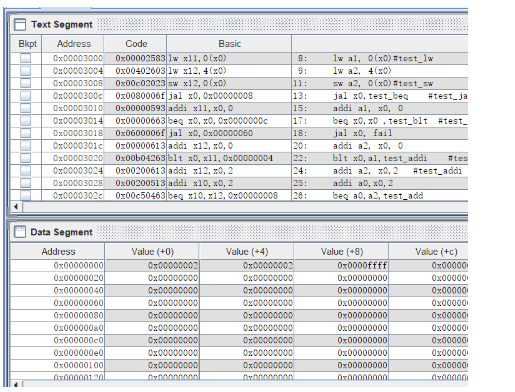

##### 仿真

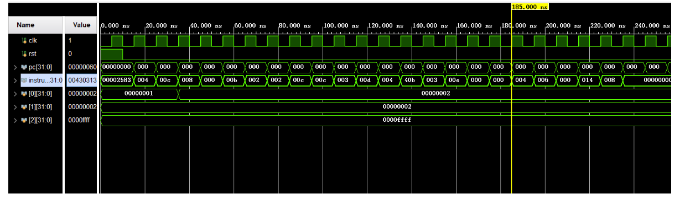

#### 2.排序

##### 汇编代码

```assembly
.data
size:.word 16
data:.word 0xf, 0xe, 0xd, 0xc, 0xb, 0xa, 0x9, 0x8, 0x7, 0x6, 0x5, 0x4, 0x3, 0x2, 0x1, 0x0

.text
sort:
	lw s0, size		#n=16
	la s1 data
	addi s2, x0, 0 		#i=0
loop1:	
    	ble s0, s2, exit1 		#if(i>=n) goto exit1
	addi s3, s2, 1    	# j=i+1
	addi s4, s2 ,0   	# min=i
loop2:  
    	beq s3,s0,swap    	#if(j=n) goto exit2
	
	slli a3, s3, 2     	#a3=j*4
	add a3, s1,a3    	#a3= data_address+j*4 
	lw t3, 0(a3)     	# j
	slli a4, s4, 2     	#a4 = min*4
	add a4, s1,a4    	#a4 = data_address+min*4 
	lw t4, 0(a4)    	#min
	ble t3, t4 , select_min    #if(data[j]<data[min]) select_min
	jal x0 ,next 
select_min:
	addi s4, s3,0
	
next:	
    addi s3, s3, 1		#j++
	jal x0,	loop2		#goto loop2
	
swap:	
	beq s2, s4, exit2    	#if(i==min) next loop1
	slli a2, s2, 2     	#a2=i*4
	add a2, s1, a2    	#a2 = data_address+i*4 
	lw t2, 0(a2)    	# i
	slli a4, s4, 2     	#t0=min*4
	add a4, s1, a4    	#t0= data_address+min*4 
	lw t4, 0(a4)    	# min
	sw t2, 0(a4)		#
	sw t4, 0(a2)
	
exit2:	addi s2, s2, 1		#i++
	jal x0, loop1		#goto loop2
exit1:
    addi,x0,x0,0

```

##### 排序结果

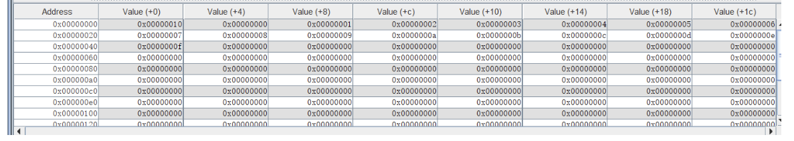

##### 仿真结果

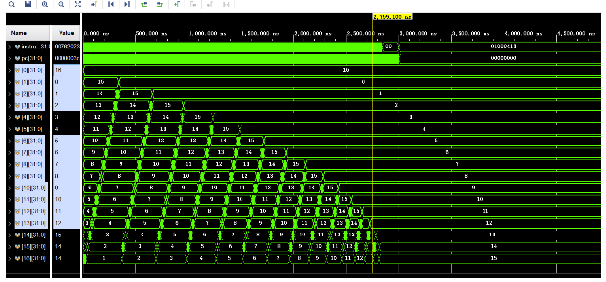

## 实验总结

- 本次实验中, 掌握了单周期CPU设计的基本步骤、Vivado仿真, 为流⽔线CPU设计打下基础.
- 本次实验中, 掌握了处理器调试单元的原理与使⽤, 为流⽔线CPU调试打下基础.