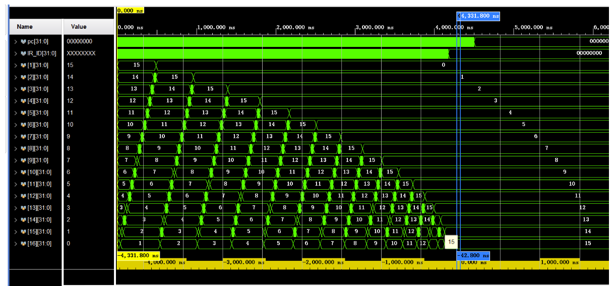
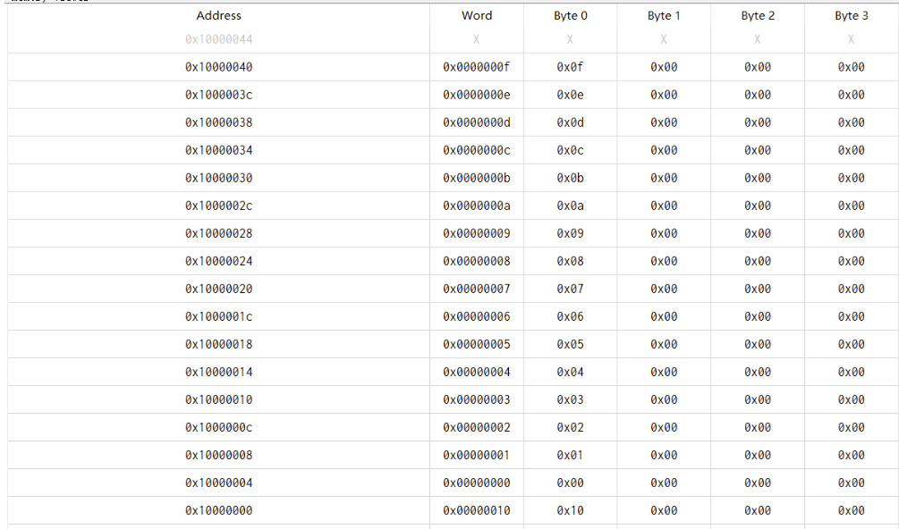

# 流水线CPU设计

> 计算机组成原理实验 五
>
> PB20020480 王润泽

## 实验目的

- 理解流水线CPU的结构和工作原理
- 掌握流水线CPU的设计和调试方法，特别是流水线中的数据相关和控制相关的处理
- 熟练掌握数据通路和控制器的设计和描述方法

## 实验环境

- Windows11
- Vivado2019

## 实验内容

- 设计5级流水线的RISC-V CPU，可执行以下10条指令

——add, addi, sub, auipc, lw, sw, beq, blt, jal, jalr

- 配合外设和调试单元PDU，实现对CPU的下载测试

## 实验设计

### 1.指令集设计

#### R-Type:

- add rd, rs1, rs2
- sub rd, rs1, rs2

#### I-Type:

- addi rd, rs1, imm
- slli rd, rs1, imm
- andi rd, rs1, imm
- lw rd, offset(rs1)

#### S-Type:

- sw rs2, offset(rs1)

#### B-Type:

- blt rs1, rs2, offset
- beq rs1, rs2, offset
- bge rs1, rs2, offset

#### J-Type:

- jal rd, offset
- jalr rd, offset(rs1)

#### U-Type:

- lui rd, imm
- auipc rd, imm

### 2.CPU数据通路


### 3.汇编排序代码

```assembly
.data
size:.word 16
data:.word 0xf, 0xe, 0xd, 0xc, 0xb, 0xa, 0x9, 0x8, 0x7, 0x6, 0x5, 0x4, 0x3, 0x2, 0x1, 0x0

.text
sort:
	addi s0, x0,16		#n=16
	la a0, data		#get address
	li s1, 0 		    #i=0

loop1:	
    	bge s1, s0, exit1 	#if(i>=n) goto exit1
    	addi s2, s0, -1	# j=n-1
loop2:  
   	bge s1,s2,exit2   	#if(i>=j) goto exit2
	slli a2, s2, 2     	#a2=j*4
	addi a2,a2,-4		#a2=(j-1)*4
	add a2, a0, a2     	#a2= data_address+j*4 
	lw t1, 0(a2)     	  #get data,data[j-1]
	lw t2, 4(a2)    	  #get data,data[j]
	bge t1, t2 , swap     #if(data[j-1]>=data[j]) swap
	jal x0 ,next 
swap:	
	sw t1, 4(a2)		    #swap 
	sw t2, 0(a2)
next:	
    addi s2, s2, -1	   		#j--
	jal x0,	loop2		    #goto loop2
	
	
exit2:	
	addi s1, s1, 1		#i++
	jal x0, loop1		#goto loop1
exit1:
     addi x0, x0, 0
```


## CPU-pipeline

### CPU Design

```verilog
/*IO*/
assign io_addr = alu_out_ME[7:0];
assign io_we = (alu_out_ME[15: 8] == 8'hff) & (mem_write_ME ==3'd3);
assign io_rd = (alu_out_ME[15: 8] == 8'hff) & mem_to_reg_WB;
assign io_dout = store_data_ME;

/*debug*/
assign chk_pc = pc_ID;

always@(*)begin
    case(chk_addr[13:12])
      2'b00:begin
        case(chk_addr[4:0])
            5'h0: chk_data = pc_in;
            5'h1: chk_data = pc_IF;
            5'h2: chk_data = pc_ID;
            5'h3: chk_data = IR_ID;    
            5'h4: chk_data = {jal_ID, jalr_ID, 
                              reg_read_ID, alu_f_ID,
                              alu_src1_ID, alu_src2_ID, branch_type_ID,
                              mem_to_reg_ID, mem_write_ID, 
                              reg_write_ID, ld_nextpc_ID};
            5'h5: chk_data = pc_EX;
            5'h6: chk_data = alu_a;
            5'h7: chk_data = alu_b;
            5'h8: chk_data = imm_ID;
            5'h9: chk_data = IR_EX;
            5'hA: chk_data = {
                              mem_to_reg_ME, mem_write_ME, 
                              reg_write_ME,ld_nextpc_ME};
            5'hB: chk_data = alu_out_EX;
            5'hC: chk_data = store_data_ME;
            5'hD: chk_data = IR_ME;
            5'hE: chk_data = {mem_write_ME, reg_write_WB,mem_to_reg_WB};
            5'hF: chk_data = load_data_ME;
            5'h10: chk_data = reg_write_data;
            5'h11: chk_data = IR_WB;
        endcase
      end
      
      2'b01:begin
        chk_data = r_data;  
      end
      2'b10:begin
        chk_data = m_data;
      end
    endcase
end

/*CPU*/

//At every state, harzard situation can occur depending on the some special signal
//Combine Forwarding and Harzard unit
Harzad_unit hazard_unit();

//IF and IFreg:renew PC and get instruction
IF_reg IF_reg();
assign pc_in=next_pc;//PC control
always @(*) begin //npc control
    if(branch_EX)
        next_pc<= branch_nextpc;
    else if (jalr_EX)
        next_pc<= alu_out_EX;
    else if (jal_EX)//at ID state, JAL and B's destination is calculated
                      // For JAl, it will jump, so  pipelining need to be stall
        next_pc<= branch_nextpc;
    else 
        next_pc <= pc_IF + 32'h4;
end

Instr_Mem InstrMem()//get instruction

//ID and IF/ID reg: Analysis instruction create control sign and generate imm 
ID_reg ID_reg();
assign instruction=IR_ID;
assign {fn7_ID, rs2_ID, rs1_ID, fn3_ID, rd_ID, op_ID} = instruction;//Decode
assign jal_nextpc = imm_ID + pc_ID;
reg_file register_file(); //read register file and may write later
control_unit control();//create control signal
imm_gen imm_gen();//gen imm 


//EX and ID/EX reg: Calculate or Compare the numbers and Make Branch Decision
EX_reg EX_reg(); // the ID registers' value delivered to EX
Branch_dec branch_dc();//branch decide
//Alu and Forward
assign forward_data1 = forward1_EX[1] ? (alu_out_ME) : ( forward1_EX[0] ? reg_write_data : reg_out1_EX );
assign forward_data2 = forward2_EX[1] ? alu_out_ME : ( forward2_EX[0] ? reg_write_data : reg_out2_EX );
assign mux_data = (alu_out_EX[15: 8]==8'hff) ? io_din : forward_data2;

assign alu_a = alu_src1_EX ? pc_EX : forward_data1;
assign alu_b = alu_src2_EX[1] ? (imm_EX) : ( alu_src2_EX[0] ? rs2_EX : forward_data2 );
assign alu_a_signed = $signed(alu_a);
assign alu_b_signed = $signed(alu_b);
alu alu();


//MEM and EX/MEM_reg: decide one of ALUresults (not include load process)
ME_reg ME_reg();
assign result_ME = ld_nextpc_ME ? (pc_ME + 4) : alu_out_ME;//for J-TYPE

Data_Mem Data_Mem ();//load and store data


//WB and MEM/WB_reg: load or store data decide the date written into Register Files
WB_reg WB_reg();
assign reg_write_data = ~mem_to_reg_WB ? result_WB : load_data_WB;

```


### a. control unit

```verilog
assign {fn7, rs2, rs1, fn3, rd, op} = instr;
assign jal_ID = (op == OP_JAL) ? 1'b1:1'b0;
assign jalr_ID = (op == OP_JALR) ? 1'b1:1'b0;
assign mem_to_reg_ID = (op == OP_LOAD) ? 1'b1:1'b0;
assign ld_nextpc_ID = jal_ID | jalr_ID ;

assign alu_src1_ID = (op == OP_AUIPC) ? 1'b1:1'b0;
assign alu_src2_ID = alu_src2_ID_reg;
always @( * ) begin
    if ((op == OP_I) && (fn3[1:0] == 2'b01))//slli, srli, sral
        alu_src2_ID_reg <= 2'b01;
    else if ((op == OP_R) || (op == OP_BRANCH) )//R-type or beq type
        alu_src2_ID_reg <= 2'b00 ;
    else//loadi addi subi lui, auipc...
        alu_src2_ID_reg <= 2'b10;
end


always @( * ) begin
    if (op == OP_BRANCH)
    begin
        case (fn3)
            3'b000:
                branch_type_ID <= BEQ;     //BEQ
            3'b001:
                branch_type_ID <= BNE;     //BNE
            3'b100:
                branch_type_ID <= BLT;     //BLT
            3'b101:
                branch_type_ID <= BGE;     //BGE
            3'b110:
                branch_type_ID <= BLTU;    //BLTU
            default:
                branch_type_ID <= BGEU;    //BGEU
        endcase
    end
    else
    begin
        branch_type_ID <= NOBRANCH;
    end
end

always@( * ) begin
  case (op)
    OP_R:
    begin
        reg_write_ID <= LW;
        mem_write_ID <= 4'b0000;
        imm_type <= RTYPE;
        case (fn3)
            3'b000:
            begin
                if (fn7[5] == 1)
                    alu_control_ID <= SUB;   //SUB
                else
                    alu_control_ID <= ADD;   //ADD
            end
            3'b001:
                alu_control_ID <= SLL;   //SLL
            3'b100:
                alu_control_ID <= XOR;   //XOR
            3'b101:
                alu_control_ID <= SRL;   //SRL
            3'b110:
                alu_control_ID <= OR;    //OR
            default:
                alu_control_ID <= AND;    //AND
        endcase
    end
    OP_I:
    begin
        reg_write_ID <= LW;
        mem_write_ID <= 4'b0000;
        imm_type <= ITYPE;
        case (fn3)
            3'b000:
                alu_control_ID <= ADD;  //ADDI
            3'b001:
                alu_control_ID <= SLL;  //SLLI
            3'b100:
                alu_control_ID <= XOR;    //XORI
            3'b101:
                alu_control_ID <= SRL;   //SRLI
            3'b110:
                alu_control_ID <= OR;   //ORI
            default:
                alu_control_ID <= AND;    //ANDI
        endcase
    end
    OP_LOAD:
    begin    //load
        mem_write_ID <= 4'b0000;
        alu_control_ID <= ADD;
        imm_type <= ITYPE;
        case (fn3)
            3'b010:
                reg_write_ID <= LW;     //LW

            default:
                reg_write_ID <= NOREGWRITE;
        endcase
    end
     OP_STORE :
    begin    //store
        reg_write_ID <= NOREGWRITE;
        alu_control_ID <= ADD;
        imm_type <= STYPE;
        case (fn3)
            3'b010:
                mem_write_ID <= 4'b1111;   //SW
            default: 
                mem_write_ID <= 4'b0000;
        endcase
    end
    OP_JAL:
    begin    //jal
        reg_write_ID <= LW;
        mem_write_ID <= 4'b0000;
        alu_control_ID <= ADD;
        imm_type <= JTYPE;
    end
    OP_JALR:
    begin    //jalr
        reg_write_ID <= LW;
        mem_write_ID <= 4'b0000;
        alu_control_ID <= ADD;
        imm_type <= ITYPE;
    end
    OP_BRANCH:
    begin    //branch
        reg_write_ID <= NOREGWRITE;
        mem_write_ID <= 4'b0000;
        imm_type <= BTYPE;
        alu_control_ID <= ADD;
    end
    OP_LUI:
    begin    //lui
        reg_write_ID <= LW;
        mem_write_ID<= 4'b0000;
        alu_control_ID <= LUI;
        imm_type <= UTYPE;
    end
    OP_AUIPC:
    begin
        reg_write_ID <= LW;
        mem_write_ID<= 4'b0000;
        alu_control_ID<= ADD;
        imm_type <= UTYPE;
    end
    default:
    begin      
        reg_write_ID <= NOREGWRITE;
        mem_write_ID <= 4'b0000;
        alu_control_ID <= ADD;
        imm_type <= ITYPE;
    end
  endcase
end

always @( * ) begin
    case (imm_type)
        RTYPE:                      //if reg_read[1]==1, 
            reg_read_ID = 2'b11;    //means this instr may use reg_data_out1
        ITYPE:                      //if reg_read[0]==1, 
            reg_read_ID = 2'b10;    //means this instr may use reg_data_out2
        STYPE:
            reg_read_ID = 2'b11;
        BTYPE:
            reg_read_ID = 2'b11;
        UTYPE:
            reg_read_ID = 2'b00;
        JTYPE:
            reg_read_ID = 2'b00;
        default:
            reg_read_ID = 2'b00;
    endcase
end
```


### b. Hazard Unit

```verilog
localparam FORWARD_EX = 2'b10;
localparam FORWARD_ME = 2'b01;
localparam NOFORWARD = 2'b00;
//forwarding decision
always @(*) begin
    if( (reg_read_EX[1] == 1))begin
        if((reg_write_ME != 3'b0) && (rd_ME == rs1_EX) && (rd_ME != 5'b0) ) 
            forward1_EX = FORWARD_EX;//if the rs1 address' target value is 
                                    //alu_out_result in forwarding EX/MEM state     
        else if((reg_write_WB != 3'b0) && (rd_WB == rs1_EX) && (rd_WB != 5'b0))
            forward1_EX = FORWARD_ME; //if the rs1 address' target value is 
                                    //the value ready to write back in MEM/WB state        
        else forward1_EX = NOFORWARD;
    end else forward1_EX = NOFORWARD;        
end

always @(*) begin
    if( (reg_read_EX[0] == 1))begin
        if((reg_write_ME != 3'b0) && (rd_ME == rs2_EX) && (rd_ME != 5'b0) ) 
            forward2_EX = FORWARD_EX;//if the rs2 address' target value is 
                                    //alu_out_result in forwarding EX/MEM state     
        else if((reg_write_WB != 3'b0) && (rd_WB == rs2_EX) && (rd_WB != 5'b0))
            forward2_EX = FORWARD_ME; //if the rs2 address' target value is 
                                    //the value ready to write back in MEM/WB state        
        else forward2_EX = NOFORWARD;
    end else forward2_EX = NOFORWARD;
end

//stall and flush decision
always @ ( * ) begin
    if (rst)
        {stall_IF, flush_IF, stall_ID, flush_ID, stall_EX, flush_EX, stall_ME, flush_ME, stall_WB, flush_WB} <= 10'b0101010101;

    //At EX state, the pc is ready to jump, so the state before MEM need to flush and IF should renew PC
    else if (branch_EX | jalr_EX)
        {stall_IF, flush_IF, stall_ID, flush_ID, stall_EX, flush_EX, stall_ME, flush_ME, stall_WB, flush_WB} <= 10'b0001010000;

    //For Load instruction, the behind state need a vaule, but the value is not loaded now! So the pipeline should stall.
    else if (mem_to_reg_EX & ((rd_EX == rs1_ID) || (rd_EX == rs2_ID)) )
        {stall_IF, flush_IF, stall_ID, flush_ID, stall_EX, flush_EX, stall_ME, flush_ME, stall_WB, flush_WB} <= 10'b1010010000;

    //At lD state, the pc is ready to jump    
    else if (jal_ID)
        {stall_IF, flush_IF, stall_ID, flush_ID, stall_EX, flush_EX, stall_ME, flush_ME, stall_WB, flush_WB} <= 10'b0101000000;
    else if (jal_EX)
        {stall_IF, flush_IF, stall_ID, flush_ID, stall_EX, flush_EX, stall_ME, flush_ME, stall_WB, flush_WB} <= 10'b0001000000;
    else
        {stall_IF, flush_IF, stall_ID, flush_ID, stall_EX, flush_EX, stall_ME, flush_ME, stall_WB, flush_WB} <= 10'b0000000000;
end
```


### c. Immediate Number Generate

```verilog
always @(*) begin//gen imm   
    case (imm_type)
        ITYPE:
            imm_ID = {{21{instruction[31]}}, instruction[30: 20] };
        STYPE:
            imm_ID = {{21{instruction[31]}}, instruction[30: 25], instruction[11: 7]};
        BTYPE:
            imm_ID = {{20{instruction[31]}}, instruction[7], instruction[30: 25], instruction[11: 8], 1'b0};
        UTYPE:
            imm_ID = {instruction[31: 12], 12'b0};
        JTYPE:
            imm_ID = {{12{instruction[31]}}, instruction[19: 12], instruction[20], instruction[30: 21], 1'b0};                                  
        default:
            imm_ID = 0;
    endcase
end
```

### d. Branch Signal

```verilog
always @(*) begin// branch decide
    case (branch_type_EX)
        BEQ:
            branch_EX = (alu_a == alu_b) ? 1'b1 : 1'b0;
        BNE:
            branch_EX = (alu_a == alu_b) ? 1'b0 : 1'b1;
        BLT:
            branch_EX = (alu_a_signed < alu_b_signed) ? 1'b1 : 1'b0;
        BLTU:
            branch_EX = (alu_a < alu_b) ? 1'b1 : 1'b0;
        BGE:
            branch_EX = (alu_a_signed >= alu_b_signed) ? 1'b1 : 1'b0;
        BGEU:
            branch_EX = (alu_a >= alu_b) ? 1'b1 : 1'b0;
        default:
            branch_EX = 1'b0;  
    endcase
end
```

### e. Register File

```verilog
reg [DW-1:0]  rf [0: 31]; 	

integer i;

assign rf_data1 = (ra1==5'b0)? (32'b0):((ra1==wa && we)? wd : rf[ra1]);
assign rf_data2 = (ra2==5'b0)? (32'b0):((ra2==wd && we)? wd : rf[ra2]);	
assign rf_data3 = (ra3==5'b0)? (32'b0):((ra3==wa && we)? wd : rf[ra3]);

always  @(posedge  clk or posedge rst) begin
    if(rst) begin
         for (i = 0;i < 32;i = i + 1)
            rf[i] <= 32'b0;
    end else if((we == 1'b1) &&wa!=5'b0)begin 
            rf[wa]  <=  wd;		//
    end
end   
```

## Vivado仿真

### 1.仿真测试：



### 2.Ripes分析



## 结果总结

1.本次试验设计的RISC-V 流⽔线CPU，经仿真测试，冒险与前递得以实现，指令功能均满⾜设计要求.

2.在本次实验中，完成了RISC-V流⽔线CPU的完整指令实现，加深了对 RSIC-V架构的理解，在理论学习的基础上,使得对组成原理的理解更加深刻
