<center><h1>对 Risc-V 流水线 CPU 的补充优化和性能评估</h1></center>

<center><h3>计算机组成原理(H)综合实验报告</h3></center>

<center><h3>小组成员：王润泽 万方</h3></center>


## 目录
[TOC]
## 一、实验环境

vivado2019

windows10

NEXYS 4 DDR

## 二、项目综述

在综合实验中，我们对 Lab5 完成的简易 CPU 做了功能的补全，并增加了新的特性以提升 CPU 指令指令执行效率，同时针对不同场景下多种优化方法的优劣性进行了初步评判。

- 补全了 I/O、中断等 CPU 缺失功能：实现了 Keyboard I\O，并用 Lab3 汇编程序设计的交互内容进行验证
- 增加了 Cache 并进行了命终率的统计和显示：Data Mem Cache，将总访存次数和命中次数通过 chk 显示在数码管上，总命中率约 $77\%$
- BHT、BTB 两种分支预测方法的实践和效率检验
- 验证了多种排序算法（快速排序、选择排序、冒泡排序）对于分支预测和 Cache 的影响
- 验证了待排数据分布（乱序、倒序）对于分支预测和 Cache 的影响
- 更改了 CPU 访存结构，实现了半字字节输入输出等指令扩展

总之，我们的项目是对已完成流水线 CPU 的补充、优化和性能评估。

## 三、I/O

为了贴近课程主题，且方便后续任务模块（排序数据的输入等）开展，实现了 Keyboard I/O（MMIO 实现）。

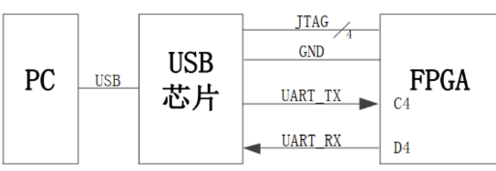


通过 UART 控制数据的传输，并将 UART 传入的信号，按照约定好的波特率（在这个实验中设置为 115200）,以规定好的传输规则编码成相应的数据帧（无信号发送时为空闲帧）：

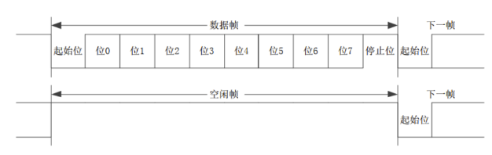


通过老师提供的异步串行通信工具，可以容易得实现数据编码发送，极大地缩减了任务量。

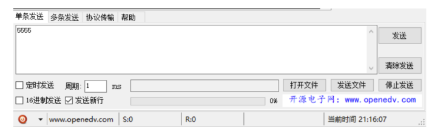


这样，我们获得了 bit0~bit7 八位的 ASCII 码，类似于 Lab3 中汇编实验的处理，进行字符串转换为数字之后就可以完成数据的输入了。


为了保证 CPU 结构的完整性，在 PDU 中进行更改。

首先例化 `rx`、`tx` 模块：

```verilog
rx RX(.clk(clk),
        .rst(1'b0),
        .rx(rx),// xdc
        .rx_vld(rx_vld),// valid
        .rx_data(rx_data));//data
tx TX(.clk(clk),
	  .rst(1'b0),
	  .tx(tx),//xdc
      .tx_rd(tx_vld),//valid
      .tx_data(tx_data),//data
	  .tx_ready(tx_ready));
```

`rx`、`tx` 为 UART 端口，进行数据的输入，`_vld` 代表当前数据是否可读\可写，`_data` 即为 ASCII 码表示的数据。

`rx`、`tx` 模块大致相同（对称，一个输入一个输出），在这里以 `rx` 为例：

正如上文的数据帧格式，`rx` 传入的每一个 bit 都可能有不同的含义，有的表示数据，有的表示读入状态。

因此，设计状态机：`C_IDLE`、`C_RX` 表示正在读入数据位（共 8 位）、正在读入状态位。

由于波特率设置为 112500，板载时钟 100MHz，计算得每个位持续约 868 个时钟周期。

在 `always` 语句块内对 `C_IDLE` 读入的位数进行累加，结果记为 `div_cnt`，当 `dic_cnt==433`（正好处于位正中间，容错率高）进行统计，之后分频器在 0~867 间循环计数（每次到 433 进行采样）。

`rx_cnt` 代表收集到的数据位数，当其超过 8 就可以开始下一个字符的处理。

```verilog
parameter   DIV_CNT   = 10'd867;
parameter   HDIV_CNT  = 10'd433;
parameter   RX_CNT    = 4'h8;
always@(*)
begin
    case(curr_state)
        C_IDLE:
            if(div_cnt==HDIV_CNT)
                next_state  = C_RX;
            else
                next_state  = C_IDLE;
        C_RX:
            if((div_cnt==DIV_CNT)&&(rx_cnt>=RX_CNT))
                next_state  = C_IDLE;
            else
                next_state  = C_RX;
    endcase
end
```


在 PDU 和 CPU 中对 I/O 的处理也是必不可少的：

- PDU 中仿照对 `seg_data` 的操作，设置 `_rdy_r` 位，获得仅持续一个周期的使能信号（不然同一数据会读入两遍）
- CPU 里新增 MUX，当进行访存操作时判断是否为 I/O 地址，若是则从 `io_data` 读入，而非 Cache
- 编写汇编程序时，仿照 Lab3 格式，设置 MMIO，数据位和状态位分别映射到数据地址，要与 PDU 和 CPU 中地址一致

```m
.data
Keyboard_state: .eqv keyboard_state,0x7f00
Keyboard_data: .eqv keyboard_data,0x7f04
Display_data: .eqv display_data,0x7f0c
Display_state: .eqv display_state,0x7f08
```


## 四、Cache

### 4.1 Cache实现

我们实现了一个 4 组的 2 路组相联 Data Mem Cache，每行四字，综合命中率约为 $77\%$。

是否命中通过 led 的明暗显示，并将总访存次数和命中次数显示在数码管上以计算命中率。

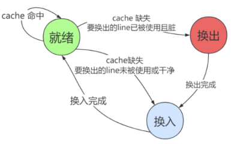


首先明确 Cache 的输入输出：来自 CPU 的读/写请求信号、访存地址、是否命中的提示、输出到 PDU 的显示数据。

结合理论课上学习的知识，我们要通过传入的地址判断访存数据在哪一组、哪一路。

判断在哪一组比较简单，截取相应的地址位即可；判断在哪一路时，可以通过位运算或另写一个组合逻辑的比较器实现。

```verilog
wire [group-1:0] which_group;//判断哪组
assign which_group=address[2:1];

wire which_way;//判断哪路
assign which_way=(address>(address^1))?1:0;//奇数地址在1路，偶数地址在0路
```

另外，Cache 需要有一个数据填充的过程，即要有 `valid` 位判断某一路是否可以被读取。

当 `valid==1` 时表明此路中的数据是有效的，这样才能进行数据地址与访存是否相等的判断。

```verilog
assign memory_access=if_write|if_read;
always @(posedge clk) begin
    if (memory_access==1)
    begin
        if (valid[which_group][which_way]==0)
        begin
            if_miss<=1;
        end
        else if (addr_cache[which_group][which_way]!=address)
        begin
            if_miss<=1;
        end
        else if_miss<=0;

        valid[which_group][which_way]<=1;
        valid[which_group][which_way^1]<=1;
        addr_cache[which_group][which_way]<=address;
        addr_cache[which_group][which_way^1]<=address^1;
    end
    else if_miss<=0;
end
```

### 4.2 cache命中率统计

我们单独设置了 `if_miss` 表示此次访存是否命中，并以此统计命中率，测试结果如下：

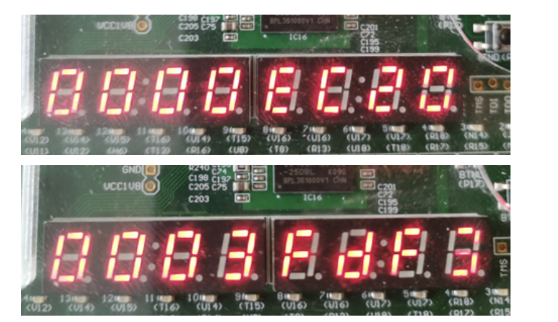

可以看到，0x3fdf3 次访存中，Cache 未命中 0xec20次，命中率约 $77\%$。

这个结果可以说明 Cache 是有效的，但还有改进的空间，我猜测限制命中率的条件主要有以下几点：

- 汇编代码编写有点问题，没有符合空间连续性逻辑
- 字长仅为 4 ，没有起到替换策略对 Cache 命中效果的影响
- Cache 空间开得太小了，改为 4 路或 8 路组相联或许会有提升


## 五、基于Branch的分支预测算法及比较

我们利用BTB与BHT实现了分支预测并进行了性能的比较，比较方式是对128个倒序排列的数据进行冒泡排序，测量其运算周期数，分支指令数及分支预测命中率，来衡量分支预测性能。

```Verilog
 always @ (negedge clk or posedge rst) begin
         if (rst) begin
             total_branch_count <= 32'b0;
             miss_branch_predict_count <= 32'b0;
         end else begin
             if (branch_type_EX!= 0) begin
                 total_branch_count <= total_branch_count + 1;
             end
             if (branch_predict_miss) begin
                 miss_branch_predict_count <= miss_branch_predict_count + 1;
             end
         end
 end
```

### 5.1 无分支预测

在流水线中无分支预测，等价于默认分支失败预测，⼀个分⽀跳转指令的代价为固定2个周期。

### 5.2 BTB实现

Branch Target Buffer（BTB）实现逻辑

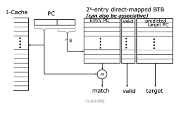

在**BTB.v**中维护⼀个buffer数组，⽤于储存预测的PC；同时维护⼀个valid数组和state数组，分别表⽰某位置处预测PC是否有效和是否跳转

```verilog
reg [32 - 1 : 0] buffer [BUFFER_SIZE];
reg valid [BUFFER_SIZE];
reg state [BUFFER_SIZE];
```

类似于Cache中的动机，地址同样被分为tag和set两部分，⽤于分组缓存中的标签和地址

```verilog
wire [SET_ADDR_LEN - 1 : 0] read_addr, write_addr;
wire [TAG_ADDR_LEN - 1 : 0] read_tag, write_tag;
reg [TAG_ADDR_LEN - 1 : 0] tag_buffer [BUFFER_SIZE];
assign {read_tag, read_addr} = pc_rd;
assign {write_tag, write_addr} = pc_wr;
```

当tag匹配且valid为1时命中，进⾏预测

```verilog
assign btb_hit = (tag_buffer[read_addr] == read_tag) && valid[read_addr];
assign btb_br = (tag_buffer[read_addr] == read_tag) && valid[read_addr] && state[read_addr];
```

BTB接在**BranchPredict.v**中，其中在EX段对是否命中进⾏了判断，并在miss时对BTB进⾏写回

```verilog
always @ (*) begin
    if (write) begin
        if (br_pred_EX == br) begin
            NPC = br_pred_IF ? btb_pc_predict : PC_rd_IF_4;
            br_predict_miss = 0;
        end else begin
            NPC = br ? PC_br_target : PC_rd_EX;
            br_predict_miss = 1;
        end
    end else begin
        NPC = br_pred_IF ? btb_pc_predict : PC_rd_IF_4;
        br_predict_miss = 0;
    end
end
```

### 5.3 无分支预测与BTB分支预测比较

当我们对无分支预测与加上BTB分支预测的流水线进行比较后，得到下图

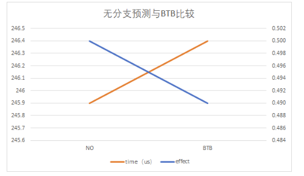

我们发现，增加BTB后，运行时间增加，分支预测命中率下降了，说明我们仅仅只基于历史分支预测的一次结果就进行预测的效果并不理想，于是我们进行了改进。

### 5.4 BHT实现

Branch History Table（BHT）的实现逻辑是，基于历史分支预测的两次结果，即连续两次分支预测成功或失败，分支预测才会更新下一次预测跳转指令。

BHT和BTB⼀起接⼊**BranchPredict.v**，并在BHT中维持⼀个2bit长的状态位；当状态超过阈值1时（即为10或11 时），则进⾏跳转

```verilog
reg [1 : 0] STATE [BUFFER_SIZE:0];
assign bht_br = (STATE[read_addr] > THRSHOLD) ? 1 : 0;

wire [SET_ADDR_LEN - 1 : 0] read_addr, write_addr;
assign read_addr = pc_rd[SET_ADDR_LEN - 1 : 0];
assign write_addr = pc_wr[SET_ADDR_LEN - 1 : 0];


integer i;
always @ (posedge clk or posedge rst) begin
    if (rst) begin
        for (i = 0; i < BUFFER_SIZE; i = i + 1) begin
            STATE[i] <= 2'b0;
        end
    end else if (write) begin
        if (br) begin
            STATE[write_addr] <= (STATE[write_addr] == 2'b11) ? 2'b11 : STATE[write_addr]+1;
        end else begin
            STATE[write_addr] <= (STATE[write_addr] == 2'b00) ? 2'b00 : STATE[write_addr]-1;
        end
    end
end
```

BranchPredict.v中跳转的条件修改为BTB预测跳转和BHT达到阈值同时满⾜

```verilog
assign br_pred_IF = btb_hit & bht_br;
```

### 5.5 不同分支预测方式比较

当结合BTB与BHT，对先前的结果进行比较

实验数据

| **Bubble** | **total** | **miss** | **effect** | **time（us）** |
| ---------- | --------- | -------- | ---------- | -------------- |
| NO         | 16513     | 8257     | 0.50       | 245.90         |
| BTB        | 16513     | 8382     | 0.49       | 246.40         |
| BHT        | 16513     | 8257     | 0.50       | 245.90         |

图像

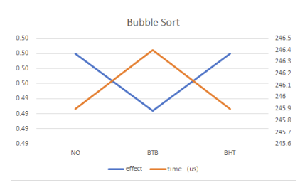

比较结果后，可以看到增加BTB与BHT后，排序效果仅仅只接近或者相等于不加分支预测（即默认分支预测失败）的流水线。

### 5.6 多种排序效率比较

基于之前的冒泡排序算法中不同分支预测方式的比较结果，我们尝试：对不同排序算法进行分支预测，来验证增加分支预测是否可以提高流水线效率。因此，我们对冒泡排序，选择排序，快速排序进行比较。（数据是倒序排列）

比较数据结果：

| Bubble（Reverse） | Total | Miss | Effect | Time（us） |
| ----------------- | ----- | ---- | ------ | ---------- |
| NO                | 16513 | 8257 | 0.50   | 245.90     |
| BTB               | 16513 | 8382 | 0.49   | 246.40     |
| BHT               | 16513 | 8257 | 0.50   | 245.90     |

| Select（Reverse） | Total | Miss | Effect | Time（us） |
| ----------------- | ----- | ---- | ------ | ---------- |
| NO                | 16641 | 4289 | 0.742  | 239.01     |
| BTB               | 16641 | 4596 | 0.724  | 247.96     |
| BHT               | 16641 | 4302 | 0.741  | 246.99     |

| Quick（Reverse） | Total | Miss | Effect | Time（us） |
| ---------------- | ----- | ---- | ------ | ---------- |
| No               | 16894 | 446  | 0.974  | 145.21     |
| BTB              | 17586 | 573  | 0.967  | 149.87     |
| BHT              | 16832 | 259  | 0.985  | 144.35     |

绘图

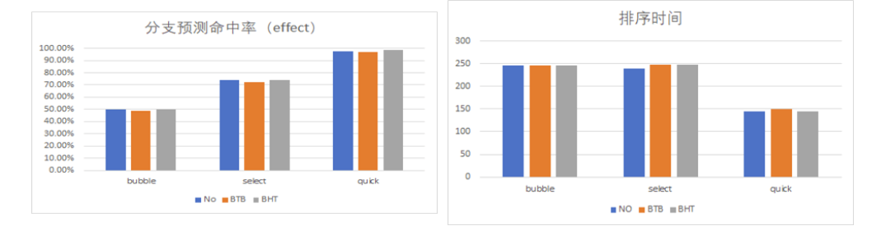


从图中可以看到，算法本身对分支预测命中率于排序时间会产生较大的影响，而总体分支条数都相差不大

具体到不同分支预测方式，可以看到对冒泡排序来说，排序时间与命中率都没有较大改善；选择排序甚至出现了分支预测降低排序效率的结果；最后对快速排序，当BTB与BHT结合，能够提高分支预测命中率，也能减小排序时间，提高排序性能。

但从实验数据来看，分支预测器与无分支预测相比，排序性能改善较小。

### 5.7 数据分布对分支预测的影响

下面则对不同数据分布进行实验测量，比较倒序排列数据与随机分布数据对分支预测器性能的影响

（1）对**冒泡排序**随机分布数据结果统计：

| Bubble(Random) | Total | Miss | Effect | Time(us) |
| -------------- | ----- | ---- | ------ | -------- |
| No             | 16513 | 4006 | 0.76   | 228.90   |
| BTB            | 16513 | 4746 | 0.71   | 231.86   |
| BHT            | 16513 | 4522 | 0.73   | 230.96   |

与之前倒序分布比较

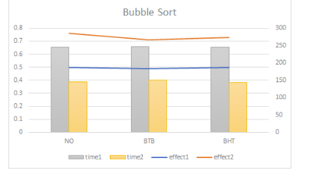

从图中可以看到，与倒序分布数据相比，随机分布数据排序时间降低，分支预测命中率提高，总分支跳转指令数不变，故排序时间主要由分支预测命中率决定。

这说明了，如果我们能进一步提高分支预测器命中率，那么对冒泡排序效率将得到改善。


（2）对**快速排序**随机分布数据结果统计

| Quick(Random) | Total | Miss | Effect | Times(us) |
| ------------- | ----- | ---- | ------ | --------- |
| No            | 2780  | 738  | 0.73   | 29.27     |
| BTB           | 4707  | 868  | 0.82   | 40.72     |
| BHT           | 3735  | 639  | 0.83   | 34.30     |

从上表中看到随机分布数据排序在不同分支预测策略下，总分支跳转指令条数、分支预测命中率和排序时间都有变化，整体上，虽然BTB与BHT可以提高分支预测命中率，但由于总跳转指令条数增加，整体排序时间依然比无分支预测流水线要大。

但依然可以看到，增加BHT后，可以对BTB的性能得到改善，不仅跳转次数减少了，而且命中率也增加了，排序效率有所提高。


与之前倒序分布比较：

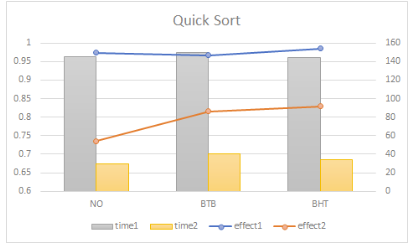

从上图中可以看到，与倒序分布数据相比，随机分布数据排序时间降低，但分支预测命中率有所下降。

### 5.8 关于分支预测器反思

对于不同的分支预测策略，基于默认分支失败策略与基于历史结果的策略，在不同排序算法与数据分布中体现的性能有所不同，这启发我们，面对不同的应用场景与使用的算法，我们应当采取恰当的分支预测策略。

同时，本实验未对jal，jalr等跳转指令进行分支预测处理，这也是可以提高程序性能的改进方式。

如果能够实现指令缓存器cache，可能也对分支预测器的性能有所改善。

## 六、指令补全（半字读写）

本实验实现了基于Risc-V的大部分指令，包含：

> Lw, LH, Lb
>
> Sw, SH, SB
>
> Add, SUB, SLL, XOR, SRL, OR, AND
>
> ADDI, SLLI, XORI, SRLI, ORI, ANDI
>
> jAL, JALR, BEQ. BNE，BGE, BLT, BLTU, BGEU
>
> LUI, AUIPC

本实验中为了添加不同长度的数据**存储功能**，实现了⼀个可选择写⼊⽅式的存储器

```verilog
module DataMem(
    input  clk,
    input  [3:0] we, 
    input  [14:2] addr,
    input  [9:2] dpra,
    input  [31:0] din,
    output reg [31: 0]dpo,douta
);
reg [31:0] ram_cell [0:4096];
integer i;
initial begin
    for(i = 0 ; i <128 ; i = i+1)
            ram_cell[i][31:0] <= 127-i;
    for(i = 128 ; i <4096 ; i = i+1)
            ram_cell[i][31:0] <= 0;
end
initial begin 
    douta=0; 
    dpo = 0;
end
always @ (posedge clk) begin
    dpo <= ram_cell[dpra];
    douta <= ram_cell[addr];
    ram_cell[addr][7: 0] <= we[0] ? din[7: 0] : ram_cell[addr][7: 0];
    ram_cell[addr][15: 8] <= we[1] ? din[15: 8] : ram_cell[addr][15: 8];
    ram_cell[addr][23:16] <= we[2] ? din[23:16] : ram_cell[addr][23:16];
    ram_cell[addr][31:24] <= we[3] ? din[31:24] : ram_cell[addr][31:24];
end  
endmodule
```

为了对不同长度的**数据读取**，实现了一个可选择读取方式的数据拓展器

```verilog
module data_ext(
           input [31: 0] data_in,
           input [1: 0] ld_bytes_select,
           input [2: 0] reg_write_WB,
           output reg [31: 0] data_out
       );      
parameter NOREGWRITE = 3'b0;	
parameter LB  = 3'd1;			
parameter LH  = 3'd2;		
parameter LW  = 3'd3;	
parameter LBU = 3'd4;			
parameter LHU = 3'd5;
//get the one byte number from 32bit data
wire [31: 0] ld_byte_in = (data_in >> (ld_bytes_select * 32'h8)) & 32'hff;
//get the half word number from 32bit data
wire [31: 0] ld_half_word_in= (data_in >> (ld_bytes_select * 32'h8)) & 32'hffff;
always @( * ) begin
    case (reg_write_WB)
        LB:
            data_out = {{24{ld_byte_in[7]}}, ld_byte_in[7: 0]};
        LH:
            data_out = {{16{ld_half_word_in[15]}}, ld_half_word_in[15: 0]};
        LW:
            data_out = data_in;
        LBU:
            data_out = {24'h0, ld_byte_in[7: 0]};
        LHU:
            data_out <= {16'h0, ld_half_word_in[15: 0]};
        default:
            data_out = data_in;
    endcase
end
endmodule
```


其他指令的实现主要是对控制单元的处理，具体实现附在代码中，不一一列举了。

## 七、总结与思考

通过完成综合实验，我们进一步学习了为 CPU 提升运行效率、增强功能性的具体方案。

我们动手实践了指令补全、分支预测、Cache 的多种实现，并在多场景（不同算法、不同数据分布）验证了方法的有效性和可靠性，为体系结构课程打下基础。

我们还通过 I/O，让 CPU 可以实现与人的交互，Debug 不再限于仅靠看仿真的波形图。

在这一次实验中，最大的收获就是当面前摆着很多解决方案（BHT,BTB），我们通过任务验证选择了特定条件下最有效的，这种探索的历程是十分宝贵的。

